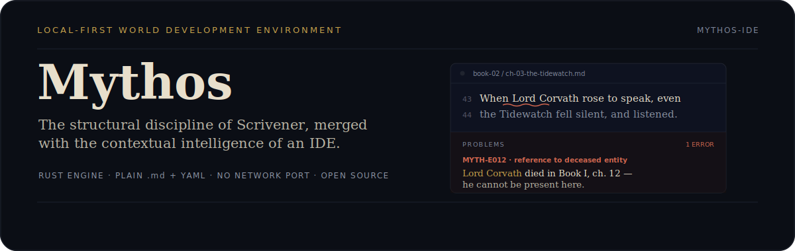

  

English · <a href="./README.TR.md">Türkçe</a>

**A writer's IDE for novelists building complex worlds.**

We're building a desktop app for fantasy, sci-fi, and epic fiction writers who outgrow generic note-taking tools and find traditional word processors too unstructured for series-length worldbuilding. Think: the structural discipline of Scrivener, merged with the contextual intelligence of a software IDE.

Mythos reads your whole series the way a compiler reads a codebase — so a character who died in Book One can't quietly speak again in Book Two without the environment flagging it.

## The ecosystem

Mythos is built as a multi-repository ecosystem, separating the engine, the interface, and the site.

| Repository | What it is | Built with |
| --- | --- | --- |
| [`mythoside-core`](https://github.com/Mythos-IDE/mythoside-core) | The engine — manuscript data model, Markdown + YAML file format, file watching, and a JSON-RPC server over stdio (no network port). | Rust |
| [`mythoside-ts`](https://github.com/Mythos-IDE/mythoside-ts) | The desktop client — the editor surface, hosting the engine as a sidecar. | Tauri · React · TypeScript |
| [`mythoside-website`](https://github.com/Mythos-IDE/mythoside-website) | The landing page and product story. | Vite · React |

## Core philosophy

- **Built for fiction, not notes** — a Series → Book → Chapter hierarchy that's built in, not something you configure yourself.
- **Contextual world-building** — type `@CharacterName` and get an instant profile card without leaving your draft.
- **Local-first, always** — plain Markdown + YAML frontmatter is the real source of truth. Your novel isn't held hostage by a server; a local SQLite (FTS5) index for instant cross-referencing is planned as a rebuildable cache, never the source of truth.
- **Continuity as diagnostics** — the environment treats worldbuilding with an IDE's rigour: reference a character after their death, or place them in two locations at once, and it tells you.

## Get involved

Early development. Follow along, star the repositories, or jump into [Discussions](https://github.com/Mythos-IDE/mythoside-core/discussions) if you're building epic-length fiction and want a say in how this shapes up.

- **Issues & feature ideas** → [Core](https://github.com/Mythos-IDE/mythoside-core/issues) · [Desktop](https://github.com/Mythos-IDE/mythoside-ts/issues)
- **General questions** → [Discussions](https://github.com/Mythos-IDE/mythoside-core/discussions)
- **Security reports** → security@mythoside.com
- **Everything else** → hello@mythoside.com

---

  Open source software by the Mythos Team.

